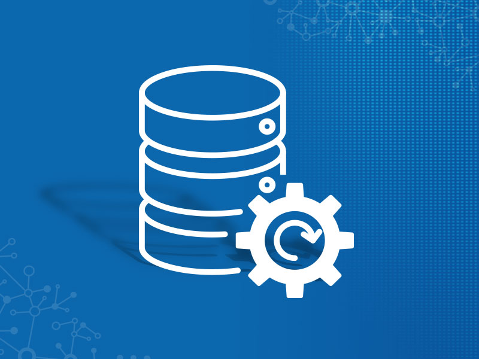

# Database
This repository contains the concepts and exercises and projects related to the SQL database that I have done so far:

Data Base It is a set of stored, stable, integrated data related and even without redundancy, with its own architecture based on the data model Specific, under the control of a centralized system, used by one or more users at a time Collaborative organization.

